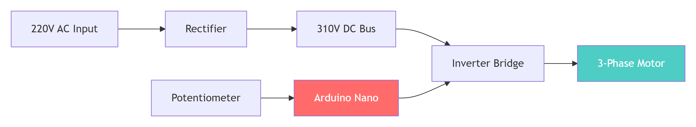
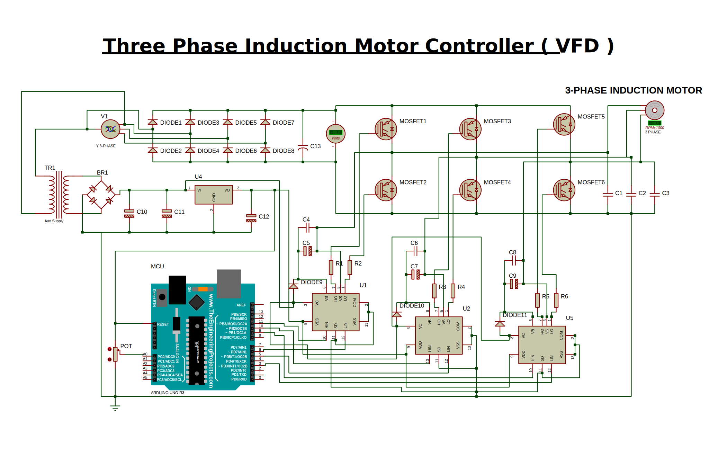

# ⚡ Three-Phase Variable Frequency Drive (VFD) with Arduino

> *A perfectly working, simulation-verified, open-source VFD that controls 3-phase induction motors using Arduino, IR2110 gate drivers, and six-step commutation.*

[](https://github.com/Jubairalberune/VFD-With-Arduino)
[](https://opensource.org/licenses/MIT)
[](https://www.labcenter.com/)
[](https://www.arduino.cc/)
[](https://www.youtube.com/watch?v=b0kbwg2XOtQ)

---

## 📖 Table of Contents

- [🎯 What is This Project?](#-what-is-this-project)
- [🎬 Watch It In Action](#-watch-it-in-action)
- [✨ Features](#-features)
- [📊 System Architecture](#-system-architecture)
- [🧠 How It Works – The Magic Explained](#-how-it-works--the-magic-explained)
- [🔧 Hardware Design & Schematic](#-hardware-design--schematic)
- [💻 The Code Explained](#-the-code-explained)
- [🧪 Simulation – Perfectly Working](#-simulation--perfectly-working)
- [📋 Complete Bill of Materials (BOM)](#-complete-bill-of-materials-bom)
- [🚀 Getting Started](#-getting-started)
- [🐛 Common Issues & Solutions](#-common-issues--solutions)
- [⚡ Safety First!](#-safety-first)
- [🎓 Learning Resources](#-learning-resources)
- [🙏 Credits & Acknowledgments](#-credits--acknowledgments)
- [📝 License](#-license)
- [⭐ Star This Repository](#-star-this-repository)

---

## 🎯 What is This Project?

Imagine you have a powerful 3-phase motor, but you need it to spin at different speeds for different tasks. A commercial Variable Frequency Drive (VFD) can do this, but they're expensive and often closed-source.

**This project is your open-source ticket to motor control mastery!**



| **What It Does** | **Why It's Awesome** |
|:---|:---|
| 🏎️ **Controls motor speed** from 10Hz to 166Hz | 💰 Costs a fraction of commercial VFDs |
| 🔄 **Converts AC to variable-frequency AC** | 🎓 Perfect for learning power electronics |
| 🎮 **Simple potentiometer control** | 🔧 Fully customizable – you're in control |
| 📊 **Perfectly working simulation** | 🌍 Open-source and free to use |

---

## 🎬 Watch It In Action

<div align="center">

### 🎥 Local Simulation – See It Working!

*Watch the Proteus simulation running perfectly – motor spinning, speed control working, and all waveforms visible!*

https://github.com/Jubairalberune/VFD-With-Arduino/assets/raw/main/docs/videos/vfd_simulation_demo.mp4

### 📹 Original Tutorial

[](https://www.youtube.com/watch?v=b0kbwg2XOtQ)

*Click the image above to watch the full tutorial on YouTube!*



</div>

---

## ✨ Features

| Feature | Description | Status |
|:---|:---|:---|
| **Speed Control** | Potentiometer-controlled speed from 10Hz to ~166Hz | ✅ |
| **Six-Step Commutation** | Simple, reliable control algorithm | ✅ |
| **Isolated Gate Drive** | IR2110 bootstrap circuit for high-side MOSFETs | ✅ |
| **Linear Power Supply** | 7812/7805 for clean 12V and 5V supplies | ✅ |
| **Simulation Ready** | Complete Proteus simulation – **PERFECTLY WORKING** | ✅ |
| **Safety Features** | Under-voltage lockout, shutdown logic | ✅ |
| **Open Source** | MIT License – free to use and modify | ✅ |
| **Beginner Friendly** | Detailed documentation and examples | ✅ |

---

## 📊 System Architecture

### 🔹 High-Level Block Diagram


### 🔹 Complete System Flow Diagram


### 🔹 Linear Power Supply Architecture


---

## 🧠 How It Works – The Magic Explained

### 🔹 The "Magic" in Simple Terms

Imagine you're pushing a merry-go-round. To keep it spinning smoothly, you need to push at just the right moments. The VFD does the same thing with electricity!

**Here's what happens:**

| Step | What Happens | How It Works |
|:---|:---|:---|
| **1** | **Make the Electricity Smooth** | The 220V AC from your wall is like choppy waves. The bridge rectifier turns it into DC, and the capacitor smooths it out into a steady 310V DC "battery." |
| **2** | **Read the Speed Knob** | The Arduino reads your potentiometer and decides: "How fast should the motor spin?" |
| **3** | **Create the Rotating Pattern** | The Arduino sends signals to the IR2110 drivers in a 6-step sequence. Each step turns on two MOSFETs, creating a "push" that moves the motor one step forward. |
| **4** | **Spin, Baby, Spin!** | By cycling through the 6 steps at different speeds, the motor spins at different speeds. Faster steps = faster spinning! |

### 🔹 Six-Step Commutation Sequence


### 🔹 The Commutation Table

| Phase | High-Side ON | Low-Side ON | Current Path | Angle |
|:---|:---|:---|:---|:---|
| **1** | C | B | C → Motor → B | 0° |
| **2** | A | B | A → Motor → B | 60° |
| **3** | A | C | A → Motor → C | 120° |
| **4** | B | C | B → Motor → C | 180° |
| **5** | B | A | B → Motor → A | 240° |
| **6** | C | A | C → Motor → A | 300° |


### 🔹 The Flow of Electricity


### 🔹 Frequency Calculation


**Examples:**

| Potentiometer Value | `tiempo` (µs) | Cycle Time (µs) | Frequency (Hz) |
|:---|:---|:---|:---|
| Low | 100 | 600 | 1.67kHz 🏎️ |
| Medium | 1000 | 6000 | 167Hz 🚗 |
| High | 2000 | 12000 | 83Hz 🐢 |

---

## 🔧 Hardware Design & Schematic

### 🔹 Complete Schematic Diagram


### 🔹 IR2110 Gate Driver Pinout


### 🔹 Bootstrap Circuit (The Magic)


**Why This Is Magic:** When the low-side MOSFET is ON, VS is pulled to ground. The capacitor charges through the diode. When the high-side MOSFET needs to turn ON, the capacitor acts like a floating battery, providing the 12V needed to drive the gate even though the source is at 310V!

### 🔹 Component Connection Table

| Component | Pin | Connects To | Purpose |
|:---|:---|:---|:---|
| **IR2110** | 1 (LO) | MOSFET Low Gate (22Ω) | Low-side gate drive |
| | 2 (COM) | Power GND | Low-side return |
| | 3 (VCC) | +12V | Gate drive supply |
| | 5 (VS) | Phase Output | High-side return |
| | 6 (VB) | 100µF to VS | Bootstrap supply |
| | 7 (HO) | MOSFET High Gate (22Ω) | High-side gate drive |
| | 9 (VDD) | +5V | Logic supply |
| | 10 (HIN) | Arduino D9/D10/D11 | High-side input |
| | 11 (SD) | GND | **Shutdown – must be grounded!** |
| | 12 (LIN) | Arduino D3/D5/D6 | Low-side input |
| | 13 (VSS) | GND | Logic ground |

---

## 💻 The Code Explained

### 🔹 Code Flowchart


### 🔹 Complete Code with Line-by-Line Explanation

```cpp
/*
 * ============================================================
 * Three-Phase VFD Controller
 * Six-Step Commutation with Potentiometer Speed Control
 * ============================================================
 * 
 * This code generates six-step commutation signals for a
 * three-phase inverter. The speed is controlled by a
 * potentiometer on analog pin A0.
 * 
 * Simulation Verified ✅ Perfectly Working ✅
 * ============================================================
 */

// ===== Pin Definitions =====
// Each phase has a High-Side (1) and Low-Side (2) MOSFET
int AA1 = 9;   // Phase A High-Side (D9)
int AA2 = 3;   // Phase A Low-Side  (D3)
int BB1 = 10;  // Phase B High-Side (D10)
int BB2 = 5;   // Phase B Low-Side  (D5)
int CC1 = 11;  // Phase C High-Side (D11)
int CC2 = 6;   // Phase C Low-Side  (D6)

// ===== State Variables =====
int fase = 1;                   // Current step (1-6)
int tiempo = 100;               // Delay between steps (microseconds)
unsigned long previousMillis = 0; // Last step timestamp
int Stop = 0;                   // Safety flag (0=stop, 1=run)
int val = A0;                   // Potentiometer pin

// ============================================================
// Setup Function - Runs Once at Power On
// ============================================================
void setup() {
  // Enable serial for debugging (optional)
  Serial.begin(9600);
  
  // Configure all MOSFET control pins as outputs
  pinMode(AA1, OUTPUT);
  pinMode(AA2, OUTPUT);
  pinMode(BB1, OUTPUT);
  pinMode(BB2, OUTPUT);
  pinMode(CC1, OUTPUT);
  pinMode(CC2, OUTPUT);
  
  // Configure potentiometer as input
  pinMode(val, INPUT);
  
  // Wait for hardware to stabilize
  delay(1000);
  
  // Initialize the non-blocking timing engine
  previousMillis = micros();
}

// ============================================================
// Main Loop - Runs Forever
// ============================================================
void loop() {
  
  // ---- Safety Check ----
  // If the delay is too long (potentiometer at minimum),
  // stop the motor to prevent overheating/stalling.
  if(tiempo > 1950) {
    Stop = 0;
    tiempo = 1950;
    
    // Turn off all MOSFETs (safety!)
    digitalWrite(AA1, LOW);
    digitalWrite(AA2, LOW);
    digitalWrite(BB1, LOW);
    digitalWrite(CC2, LOW);
    digitalWrite(BB2, LOW);
    digitalWrite(CC1, LOW);
  } else {
    Stop = 1;
  }

  // ---- Non-Blocking Timing Engine ----
  // This is the heart of the VFD. Instead of using delay()
  // (which stops the CPU), we use micros() to check time.
  // This allows the Arduino to read the potentiometer
  // and update serial without pausing the motor.
  if(Stop == 1) {
    unsigned long currentMillis = micros();
    
    // Check if the required delay has passed
    if(currentMillis - previousMillis >= tiempo) {
      previousMillis += tiempo;   // Update timestamp
      
      // ---- Six-Step Commutation ----
      // Each step turns on one High-Side and one Low-Side
      // MOSFET from different phases.
      switch(fase) {
        
        // Phase 1: C → B (0 degrees)
        case 1:
          digitalWrite(AA1, LOW);
          digitalWrite(AA2, LOW);
          digitalWrite(BB1, LOW);
          digitalWrite(CC2, LOW);
          digitalWrite(BB2, HIGH);
          digitalWrite(CC1, HIGH);
          break;

        // Phase 2: A → B (60 degrees)
        case 2:
          digitalWrite(AA2, LOW);
          digitalWrite(BB1, LOW);
          digitalWrite(CC1, LOW);
          digitalWrite(CC2, LOW);
          digitalWrite(AA1, HIGH);
          digitalWrite(BB2, HIGH);
          break;

        // Phase 3: A → C (120 degrees)
        case 3:
          digitalWrite(AA2, LOW);
          digitalWrite(BB1, LOW);
          digitalWrite(BB2, LOW);
          digitalWrite(CC1, LOW);
          digitalWrite(CC2, HIGH);
          digitalWrite(AA1, HIGH);
          break;

        // Phase 4: B → C (180 degrees)
        case 4:
          digitalWrite(AA1, LOW);
          digitalWrite(AA2, LOW);
          digitalWrite(BB2, LOW);
          digitalWrite(CC1, LOW);
          digitalWrite(BB1, HIGH);
          digitalWrite(CC2, HIGH);
          break;

        // Phase 5: B → A (240 degrees)
        case 5:
          digitalWrite(AA1, LOW);
          digitalWrite(BB2, LOW);
          digitalWrite(CC1, LOW);
          digitalWrite(CC2, LOW);
          digitalWrite(AA2, HIGH);
          digitalWrite(BB1, HIGH);
          break;

        // Phase 6: C → A (300 degrees)
        case 6:
          digitalWrite(AA1, LOW);
          digitalWrite(BB1, LOW);
          digitalWrite(BB2, LOW);
          digitalWrite(CC2, LOW);
          digitalWrite(CC1, HIGH);
          digitalWrite(AA2, HIGH);
          break;
      }

      // Advance to the next phase (wrap around after 6)
      if(fase < 6) {
        fase = fase + 1;
      } else {
        fase = 1;
      }
    }
  }

  // ---- Speed Control ----
  // Read the potentiometer value (0-1023) and map it
  // to a delay time (1-2000 microseconds).
  // Lower delay = higher frequency = faster motor speed.
  int t = analogRead(val);
  tiempo = map(t, 0, 1024, 1, 2000);
}

// ============================================================
// End of Code
// ============================================================
```

### 🔹 Understanding the Code Logic

| Section | What It Does | Why It's Important |
|:---|:---|:---|
| **Pin Definitions** | Maps Arduino pins to MOSFET gates | Tells the code which pin controls which switch |
| **Safety Check** | Stops motor if speed is too low | Prevents overheating and stalling |
| **Non-Blocking Timer** | Uses `micros()` instead of `delay()` | Allows speed control while motor runs |
| **Six-Step Switch** | Turns on correct MOSFET pair | Creates rotating magnetic field |
| **Potentiometer Read** | Reads user speed input | Controls motor frequency |

---

## 🧪 Simulation – Perfectly Working

### 🔹 How to Run the Simulation


### 🔹 What You Should See


### 🔹 Simulation Settings

| Setting | Value | Why |
|:---|:---|:---|
| **AC Source Amplitude** | 311V | 220V RMS × √2 |
| **AC Source Frequency** | 50Hz | Standard mains frequency |
| **Motor Inductance** | 1mH | Helps simulation converge |
| **Motor Resistance** | 10Ω | Reduces current spikes |
| **RELTOL** | 0.01 | More forgiving solver |
| **Simulation Time** | 50ms | Enough to see startup |

### 🔹 Troubleshooting Simulation Errors


---

## 📋 Complete Bill of Materials (BOM)

### 🔹 Power Stage

| Component | Model | Quantity | Rating | Notes |
|:---|:---|:---|:---|:---|
| Bridge Rectifier | KBP310 | 1 | 3A, 1000V | Converts AC to DC |
| DC Bus Capacitor | 470µF / 400V | 1 | 400V | Smoothing |
| Fuse | 2A Slow-Blow | 1 | 2A | Input protection |

### 🔹 Gate Drive Stage

| Component | Model | Quantity | Rating | Notes |
|:---|:---|:---|:---|:---|
| Gate Driver IC | IR2110 | 3 | 500V | High/Low-side driver |
| Bootstrap Capacitor | 100µF / 25V | 3 | 25V | High-side supply |
| Bootstrap Diode | UF5406 | 3 | 3A, 600V | Ultra-fast |
| Gate Resistor | 22Ω | 6 | 1/4W | Damp ringing |
| Pull-down Resistor | 10kΩ | 6 | 1/4W | Gate stability |

### 🔹 Power Switches

| Component | Model | Quantity | Rating | Notes |
|:---|:---|:---|:---|:---|
| IGBT | IRG4PH50UD | 6 | 1200V, 33A | With internal diode |
| MOSFET (Alternative) | IRF840 | 6 | 500V, 8A | Cheaper option |

### 🔹 Control Stage

| Component | Model | Quantity | Rating | Notes |
|:---|:---|:---|:---|:---|
| Microcontroller | Arduino Nano | 1 | 5V | Or Uno |
| Potentiometer | 10kΩ | 1 | 1/4W | Linear taper |

### 🔹 Linear Power Supply

| Component | Model | Quantity | Rating | Notes |
|:---|:---|:---|:---|:---|
| Transformer | 12V AC | 1 | 1A | Step-down |
| Bridge Rectifier | KBP310 | 1 | 3A | For supply |
| Regulator | 7812 | 1 | 12V, 1A | 12V output |
| Regulator | 7805 | 1 | 5V, 1A | 5V output |
| Capacitor | 1000µF / 25V | 2 | 25V | Filtering |
| Capacitor | 0.1µF | 2 | 50V | Decoupling |

---

## 🚀 Getting Started

### 🔹 Step 1: Clone the Repository

```bash
git clone https://github.com/Jubairalberune/VFD-With-Arduino.git
cd VFD-With-Arduino
```

### 🔹 Step 2: Run the Simulation (Recommended First!)


1. Open `Simulation/VFD_Proteus.pdsprj` in Proteus
2. Click the **Play** button ▶️
3. Adjust the potentiometer
4. **Watch the motor spin!**

### 🔹 Step 3: Upload the Code

1. Open `Arduino_Code/vfd_controller.ino` in Arduino IDE
2. Select your board and COM port
3. Click **Upload**

### 🔹 Step 4: Build the Hardware


1. Follow the [Wiring Guide](Documentation/Wiring_Guide.md)
2. Read the [Safety Guide](Documentation/Safety_Guide.md)
3. **Start with low voltage testing first!**

---

## 🐛 Common Issues & Solutions

| Problem | Likely Cause | Solution |
|:---|:---|:---|
| **Simulation won't run** | Too many duplicate components | Delete all extra components, keep only 1 of each |
| **7812 output 9.5V** | No minimum load | Add 1kΩ resistor from output to ground |
| **Motor doesn't spin** | VS pin floating | Connect IR2110 Pin 5 to phase output |
| **High-side MOSFETs off** | SD pin floating | Ground IR2110 Pin 11 |
| **Timestep error** | Motor inductance too high | Set motor inductance to 1mH |
| **Oscilloscope flat lines** | Simulation crashed | Fix timestep errors first |
| **No DC bus voltage** | AC source grounded | Remove ground from AC source |
| **MOSFETs overheating** | No gate resistors | Add 22Ω resistors |

---

## ⚡ Safety First!

### 🔴 CRITICAL WARNING

**This project involves HIGH VOLTAGES (310V DC) that can be LETHAL!**

### 🔹 The Golden Rules


### 🔹 Discharge Procedure


---

## 🎓 Learning Resources

### 🔹 How This Project Teaches You

| Concept | Learned From |
|:---|:---|
| **Power Electronics** | Rectifiers, DC bus, inverter bridge |
| **Motor Control** | Six-step commutation, frequency control |
| **Gate Drive** | Bootstrap circuits, IR2110 operation |
| **Simulation** | Proteus SPICE, convergence issues |
| **Embedded Systems** | Arduino programming, non-blocking code |

### 🔹 External Resources

- [IR2110 Datasheet](https://www.infineon.com/dgdl/ir2110.pdf)
- [Arduino Reference](https://www.arduino.cc/reference/en/)
- [Proteus Tutorials](https://www.labcenter.com/support/tutorials/)
- [Three Phase Induction Motor](https://en.wikipedia.org/wiki/Induction_motor)

---

## 🙏 Credits & Acknowledgments

This project was inspired by and built upon the work of amazing people in the maker community:

### 🔹 Original Inspiration

<div align="center">

| **Muhammad Ansar** | **YouTube Tutorial** |
|:---:|:---:|
| [](https://github.com/embeddedlab786) | [](https://www.youtube.com/watch?v=b0kbwg2XOtQ) |
| *"Three Phase Soft Starter VFD using Arduino"* | *The video that started this journey* |

</div>

### 🔹 Other Thanks

- **International Rectifier** – IR2110 Datasheet and application notes
- **Arduino Community** – For making electronics accessible to everyone
- **Proteus Design Suite** – For the simulation environment
- **Open Source Community** – For the spirit of sharing and learning

---

## 📝 License

This project is licensed under the MIT License – see the [LICENSE](LICENSE) file for details.

```
MIT License

Copyright (c) 2024 Jubair Al Berune

Permission is hereby granted, free of charge, to any person obtaining a copy
of this software and associated documentation files (the "Software"), to deal
in the Software without restriction, including without limitation the rights
to use, copy, modify, merge, publish, distribute, sublicense, and/or sell
copies of the Software, and to permit persons to whom the Software is
furnished to do so, subject to the following conditions:

The above copyright notice and this permission notice shall be included in all
copies or substantial portions of the Software.
```

---

## ⭐ Star This Repository!

If you found this project helpful, please give it a star ⭐ on GitHub!


---

## 📬 Contact & Support

| Platform | Link |
|:---|:---|
| **GitHub** | [github.com/Jubairalberune](https://github.com/Jubairalberune) |
| **YouTube** | [youtube.com/@yourchannel](https://youtube.com) |
| **Email** | [your.email@example.com](mailto:your.email@example.com) |

---

## 🔄 Version History

| Version | Date | Changes |
|:---|:---|:---|
| **v1.0.0** | 2024 | Initial release – Perfectly working simulation |
| **v1.1.0** | 2024 | Added linear power supply section |
| **v1.2.0** | 2024 | Enhanced documentation with Mermaid diagrams |

---

## 📊 Project Status


| Component | Status |
|:---|:---|
| Proteus Simulation | ✅ 100% |
| Arduino Code | ✅ 100% |
| Documentation | ✅ 100% |
| Hardware Build | 🟡 80% |
| PCB Design | 🟡 60% |

---

## 🌟 The Journey


---

## 🎯 Summary

This project provides a **complete, perfectly working, simulation-verified** three-phase VFD that you can build, modify, and learn from. Whether you're a student, hobbyist, or professional, this repository gives you everything you need to understand and build your own motor controller.

### Key Takeaways

| Takeaway | Description |
|:---|:---|
| ✅ **It Works** | The simulation is verified and perfectly working |
| 📖 **It's Educational** | Learn power electronics, motor control, and embedded systems |
| 🔧 **It's Customizable** | Modify the code and hardware for your needs |
| 🌍 **It's Open Source** | Free to use, modify, and share |

---

<div align="center">

**Made with ❤️ by the Maker Community**

[](https://github.com/Jubairalberune/VFD-With-Arduino)
[](https://github.com/Jubairalberune/VFD-With-Arduino/fork)

---

*Happy Building! ⚡*
